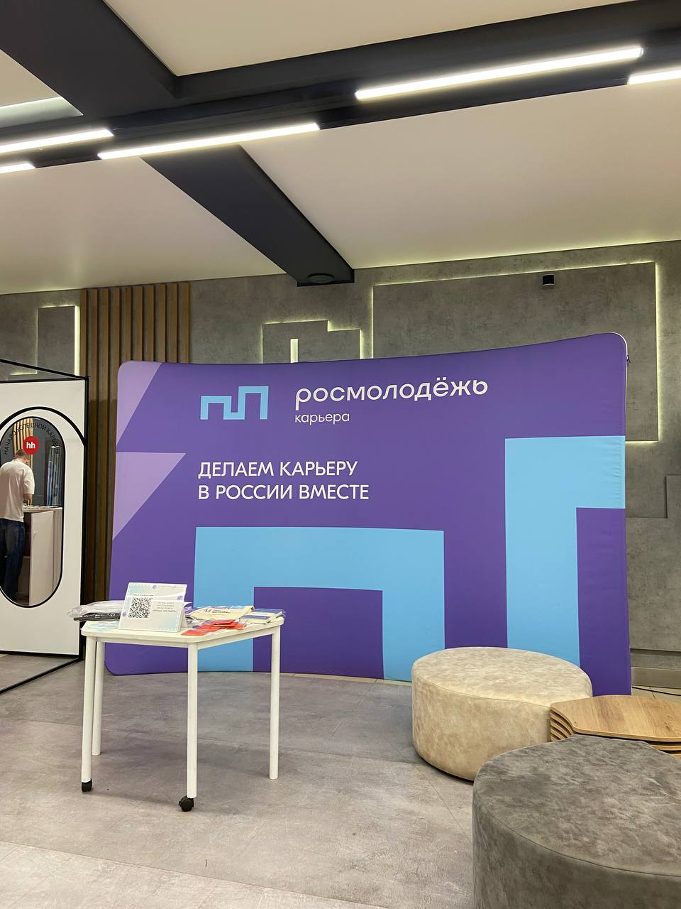
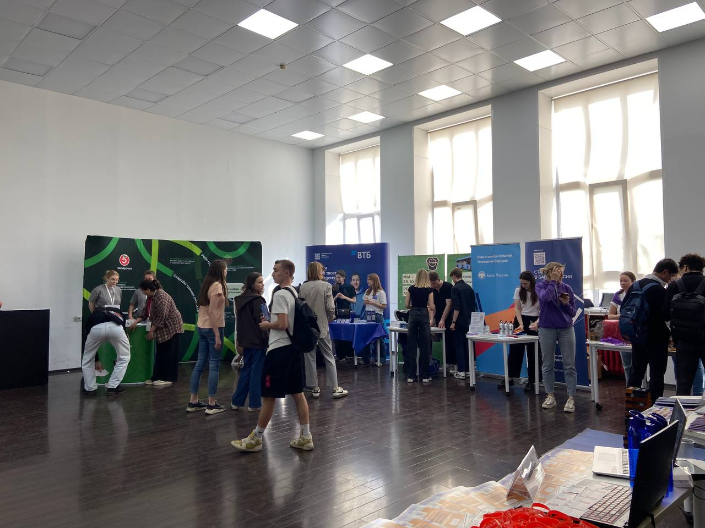
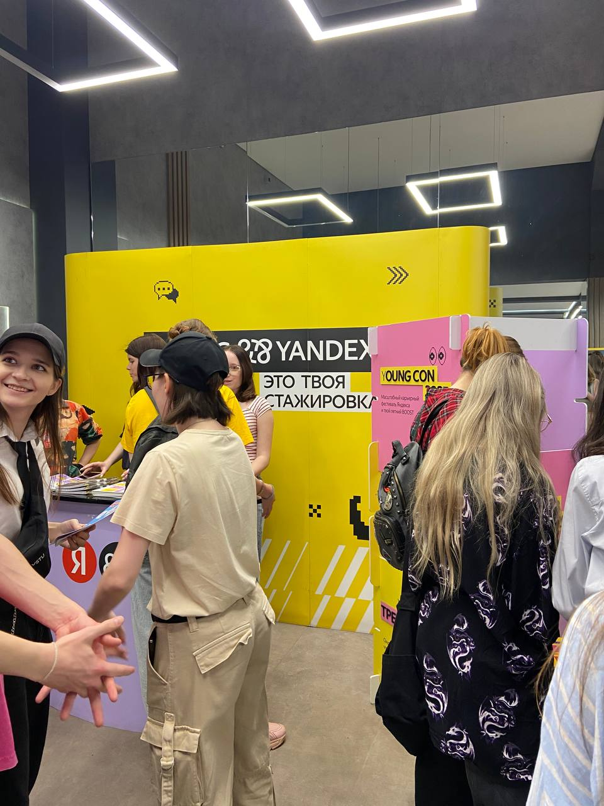

# Отчёт о посещении мероприятия "Карьерный марафон"
---
## Введение

**Цель посещения мероприятия:**
- Узнать об индустриальных партнёрах Московского политеха
- Пообщаться с представителями

 **Дата и место провединия:**
 22 апреля, Большая Семёновская ул., 38

 **Время проведения:**
 15:00-18:00 (3 часа)

 **Организаторы:**
- Московский политехнический институт
---
## Описание мероприятия

**Формат мероприятия:**
- интересные тренинги и мастер-классы от экспертов
- выставка компаний и общение с будущими работодателями
- призы и подарки от партнёров
---
## Фотоотчёт

---
## Итоги и выводы
Я получила опыт в общении с потенциальными будущими работодателями, узнала об индустриальных партнёрах Московского политеха. Этот опыт пригодится мне в будущем, когда я буду учиться на старших курсах