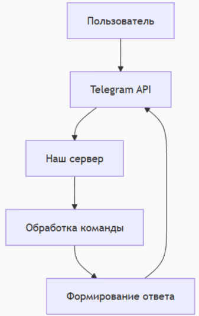

# Руководство по созданию простого Telegram-бота

## Введение
В этом руководстве мы создадим простейшего Telegram-бота, который будет отвечать на команды пользователя. Это идеальный проект для начинающих, позволяющий понять основы работы с Telegram Bot API.

## Исследование предметной области
### Анализ возможностей Telegram Bot API
Telegram предоставляет мощный API для создания ботов с такими возможностями:
- Отправка и получение сообщений
- Работа с клавиатурами
- Обработка команд
- Хранение состояния

### Выбор инструментов
Для нашего бота мы будем использовать:
- Python 3.8+ (простой и понятный синтаксис)
- Библиотеку python-telegram-bot (официальная обертка для API)
- Виртуальное окружение (для изоляции зависимостей)

## Техническое руководство
### Подготовка окружения
1. Установите Python с официального сайта
2. Создайте папку для проекта
3. Создайте виртуальное окружение:
python -m venv venv
source venv/bin/activate  # Для Linux/Mac
venv\Scripts\activate     # Для Windows

### Установка зависимостей
pip install python-telegram-bot

### Создание бота
1. Найдите в Telegram @BotFather
2. Отправьте команду /newbot
3. Следуйте инструкциям и получите токен

### Базовый код бота
Создайте файл bot.py:
from telegram import Update
from telegram.ext import Application, CommandHandler, MessageHandler, filters

TOKEN = "ВАШ_ТОКЕН"

async def start(update: Update, context):
    await update.message.reply_text("Привет! Я простой бот.")

async def echo(update: Update, context):
    await update.message.reply_text(update.message.text)

def main():
    app = Application.builder().token(TOKEN).build()
    
    app.add_handler(CommandHandler("start", start))
    app.add_handler(MessageHandler(filters.TEXT & ~filters.COMMAND, echo))
    
    app.run_polling()

if name == "main":
    main()

### Запуск бота
python bot.py

## Архитектура бота

## Дополнительные функции
### Добавление новых команд
async def help(update: Update, context):
    await update.message.reply_text("Доступные команды:\n/start - Начать\n/help - Помощь")

 #В функции main()
app.add_handler(CommandHandler("help", help))

### Клавиатура
from telegram import ReplyKeyboardMarkup

async def menu(update: Update, context):
    keyboard = [["Option 1", "Option 2"]]
    reply_markup = ReplyKeyboardMarkup(keyboard)
    await update.message.reply_text("Выберите:", reply_markup=reply_markup)

## Развертывание
### Требования
Создайте файл requirements.txt:
python-telegram-bot==20.3

### Запуск на сервере
Для постоянной работы можно использовать:
- PythonAnywhere
- Heroku
- Render

## Заключение
Теперь у вас есть работающий Telegram-бот! Дальнейшие шаги:
- Добавить обработку разных типов сообщений
- Реализовать хранение данных
- Настроить вебхуки для более стабильной работы