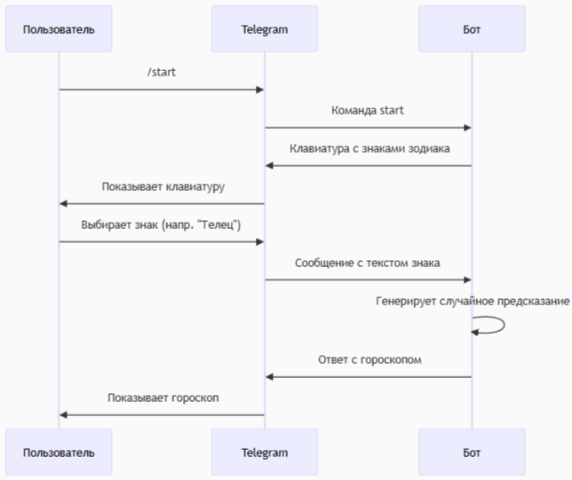
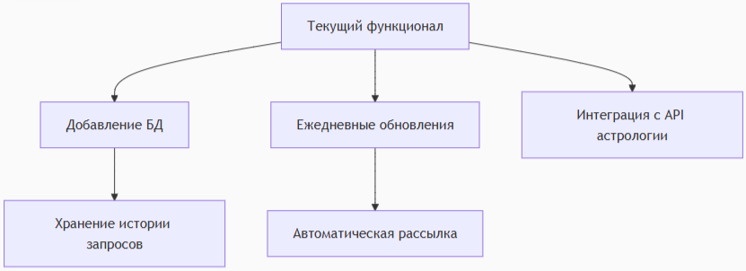
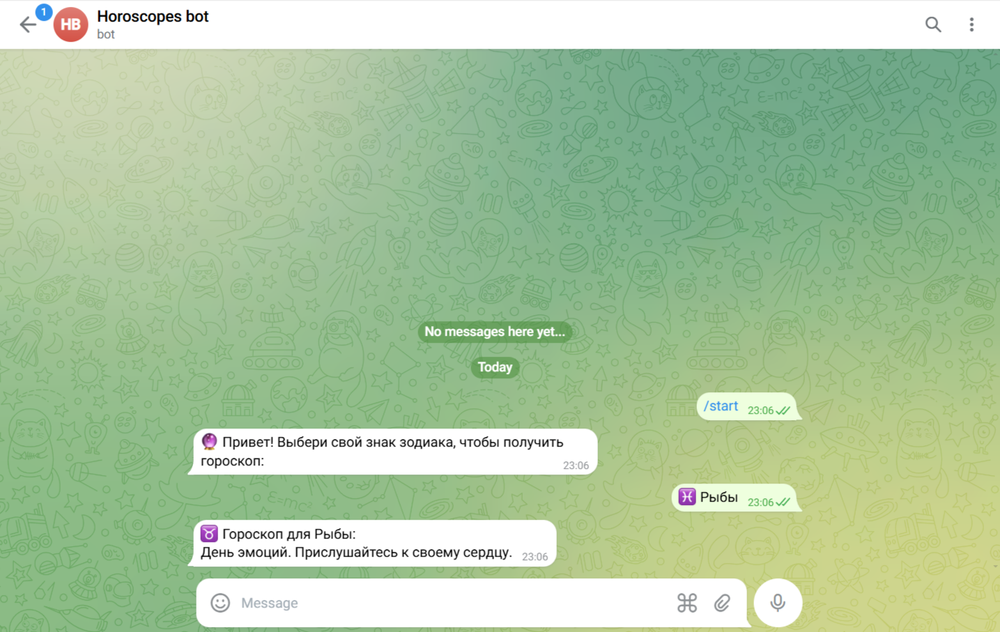
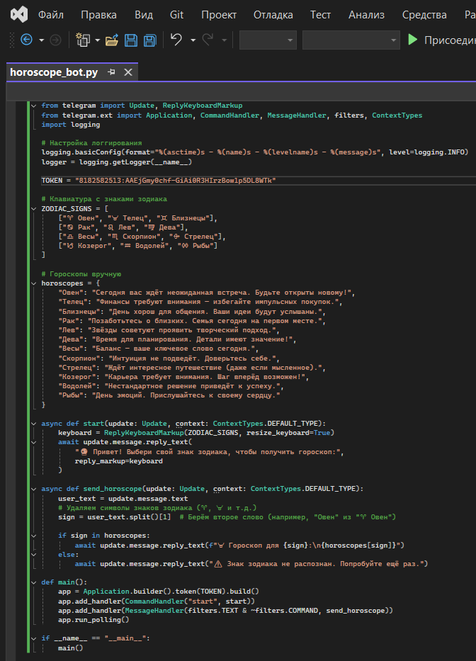

# Техническое руководство: Telegram-бот для предсказания гороскопов

## Введение
Это руководство описывает создание Telegram-бота для генерации ежедневных гороскопов. Бот написан на Python с использованием библиотеки pyTelegramBotAPI.

## Архитектура системы
### Диаграмма последовательностей

## Пошаговая реализация
### Настройка проекта
1. Установите Python 3.8+
2. Установите необходимые библиотеки:
pip install pyTelegramBotAPI

### Структура кода
#Импорт библиотек
import telebot
from telebot import types
import random

#Конфигурация бота
TOKEN = "ВАШ_ТОКЕН"
bot = telebot.TeleBot(TOKEN)

#Данные гороскопов
zodiac_signs = ["Овен", "Телец", ..., "Рыбы"]
horoscope_predictions = {
    "Овен": ["Предсказание 1", "Предсказание 2"],
    ...
}

#Обработчики сообщений
@bot.message_handler(commands=['start'])
def send_welcome(message):
    # Создание клавиатуры
    markup = types.ReplyKeyboardMarkup(row_width=3, resize_keyboard=True)
    buttons = [types.KeyboardButton(sign) for sign in zodiac_signs]
    markup.add(*buttons)
    
    # Отправка сообщения
    bot.reply_to(message, "Приветственное сообщение", reply_markup=markup)

@bot.message_handler(func=lambda message: message.text in zodiac_signs)
def send_horoscope(message):
    # Логика генерации гороскопа
    sign = message.text
    prediction = random.choice(horoscope_predictions[sign])
    
    # Форматирование ответа
    response = f"*{sign}*, вот твой гороскоп:\n\n_{prediction}_"
    bot.reply_to(message, response, parse_mode="Markdown")

#Запуск бота
if name == "main":
    bot.polling()

## Детали реализации
### Клавиатура выбора знака
markup = types.ReplyKeyboardMarkup(row_width=3, resize_keyboard=True)
buttons = [types.KeyboardButton(sign) for sign in zodiac_signs]
markup.add(*buttons)

### Генерация предсказаний
prediction = random.choice(horoscope_predictions[sign])

### Форматирование ответа
Использование Markdown для красивого отображения:
response = f"*{sign}*, вот твой гороскоп:\n\n_{prediction}_"
bot.reply_to(message, response, parse_mode="Markdown")

## Расширение функционала
### Добавление новых команд
@bot.message_handler(commands=['help'])
def send_help(message):
    help_text = "Доступные команды:\n/start - Начать\n/help - Помощь"
    bot.reply_to(message, help_text)

### Логирование
import logging

logging.basicConfig(
    level=logging.INFO,
    format="%(asctime)s - %(name)s - %(levelname)s - %(message)s"
)
logger = logging.getLogger(name)

@bot.message_handler(func=lambda message: True)
def log_message(message):
    logger.info(f"Получено сообщение: {message.text}")

## Тестирование
### Пример тестирования
def test_horoscope_generation():
    test_sign = "Овен"
    prediction = random.choice(horoscope_predictions[test_sign])
    assert prediction in horoscope_predictions[test_sign]
    print(f"Тест пройден для {test_sign}")

## Возможные улучшения (модификация)
### Диаграмма улучшений

### Список улучшений
1. Интеграция с внешними API астрологии
2. Добавление временных меток для ежедневных гороскопов
3. Система подписок на ежедневные гороскопы

## Пример выполнения программы и полный код

## Заключение
Этот бот представляет собой простую, но функциональную реализацию сервиса гороскопов в Telegram. Руководство охватывает все аспекты разработки - от архитектуры до тестирования. Код легко модифицируется и расширяется под конкретные нужды.